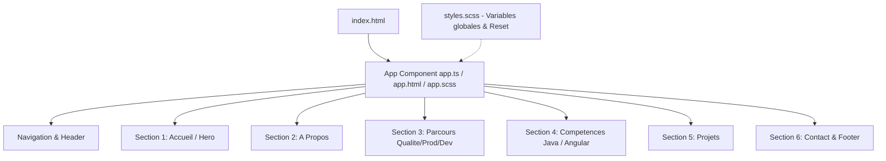

# Requirements

### Overview & Goals
L'objectif est de mettre en place une première version visuelle (V1) fonctionnelle et responsive du portfolio au sein d'une page unique (*Single-Page*). Cette version met en valeur le profil d'ingénieur Full-Stack Java / Angular ainsi que la continuité d'expérience (intégration, recette, production et développement), tout en gardant une architecture volontairement simple et sans abstractions prématurées.

### Scope
- **In Scope** :
  - Structure monolithique simple dans le composant racine `App` pour valider rapidement le rendu visuel.
  - Les 6 sections clés : Accueil, À propos, Parcours, Compétences, Projets, Contact.
  - Navigation fluide par ancres (`#accueil`, `#a-propos`, etc.) avec menu adapté au mobile.
  - Styles sur mesure en SCSS pur (variables de thème, CSS Grid, Flexbox, media queries).
  - Accessibilité WCAG AA (contrastes, navigation au clavier, balises sémantiques).
- **Out of Scope** :
  - Découpage en multiples sous-composants (réservé à l'étape ultérieure de refactorisation une fois le visuel validé).
  - Services d'injection de données (`PortfolioDataService`) ou modèles TypeScript complexes.
  - Bibliothèques UI externes (Angular Material, Bootstrap, Tailwind, PrimeNG).
  - Routage multi-pages complexe.

### User Stories
- **En tant que recruteur ou visiteur technique**, je veux naviguer facilement entre les différentes sections de la page pour découvrir rapidement le profil, les compétences Java/Angular et le parcours du développeur.
- **En tant qu'utilisateur sur smartphone ou tablette**, je veux une interface parfaitement responsive et lisible pour consulter le portfolio dans de bonnes conditions.
- **En tant que développeur / propriétaire du portfolio**, je veux une base de code claire, compréhensible et facile à enrichir progressivement sans sur-ingénierie initiale.

### Functional Requirements
- **Navigation** : barre de navigation fixe avec défilement fluide vers chaque section et bascule de menu mobile accessible via un `signal`.
- **Section Accueil** : titre principal clair, sous-titre valorisant le double profil Java & Angular, boutons d'appel à l'action (*Call-to-Action* vers contact et projets).
- **Section À propos** : texte synthétique présentant la démarche d'ingénierie et la vision du cycle de vie logiciel.
- **Section Parcours** : mise en valeur chronologique ou thématique de la transition Intégration / Recette -> Production -> Développement Full-Stack.
- **Section Compétences** : présentation claire des piliers techniques (Java/Spring Boot, Angular/TypeScript, Pratiques de test & CI/CD).
- **Section Projets** : cartes de projets avec titre, description, technologies clés et liens/statuts.
- **Section Contact** : liens directs email, LinkedIn et GitHub.

### Non-Functional Requirements
- **Performance** : composant configuré avec `ChangeDetectionStrategy.OnPush`, aucun poids inutile dans le bundle.
- **Accessibilité** : balises HTML sémantiques (`<header>`, `<nav>`, `<main>`, `<section>`, `<footer>`), gestion des contrastes et outline visible au focus.
- **Compatibilité & Responsivité** : adaptation fluide de 320px (mobile) à 1920px+ (grands écrans).

# Technical Design

### Current Implementation
Le projet est initialisé avec Angular 21.2 en mode standalone :
- `src/app/app.ts` : composant racine avec `imports: [RouterOutlet]` et un template d'exemple.
- `src/app/app.html` : 354 lignes de démonstration par défaut Angular CLI.
- `src/app/app.scss` : fichier vide.
- `src/styles.scss` : fichier vide.
- `src/app/app.routes.ts` : tableau de routes vide (`routes: Routes = []`).

### Key Decisions
1. **Composant unique pour la V1 visuelle** :
   - *Choix* : intégrer les 6 sections directement dans `app.html` / `app.scss` / `app.ts` au lieu de créer immédiatement 6 dossiers de sous-composants.
   - *Raison* : permet de prévisualiser, ajuster l'harmonie graphique et comprendre chaque bloc sans dispersion de fichiers. La modularisation en sous-composants et services interviendra en V2 une fois la maquette validée.
2. **Gestion de l'état local minimal avec Signals** :
   - *Choix* : utiliser un simple `signal(false)` dans `App` pour gérer l'ouverture/fermeture du menu responsive mobile.
   - *Raison* : respecte les bonnes pratiques Angular modernes sans ajouter de dépendance ou de service externe.
3. **Styles SCSS personnalisés purs** :
   - *Choix* : utiliser les variables CSS natives combinées à SCSS pour gérer le thème (palette sombre/claire moderne, espacements cohérents, grilles responsives).
   - *Raison* : zéro dépendance externe, bundle minimal, contrôle total sur le design et l'accessibilité.

### File Structure & Roles

```
src/
├── app/
│   ├── app.ts          # Logique du composant racine (état du menu mobile, OnPush)
│   ├── app.html        # Structure HTML sémantique des 6 sections
│   ├── app.scss        # Styles SCSS responsifs spécifiques aux sections et au layout
│   └── app.spec.ts     # Test unitaire Vitest pour le composant App
├── styles.scss         # Variables globales CSS, reset, typographie et base commune
└── index.html          # Métadonnées et titre de la page
```

#### Rôle précis des fichiers modifiés :
- **`src/styles.scss`** :
  - Définit les variables CSS (`--primary-color`, `--bg-color`, `--text-color`, etc.).
  - Réinitialisation CSS minimale et `scroll-behavior: smooth`.
- **`src/app/app.html`** :
  - Regroupe le `<header>` (nav), le `<main>` (sections `#accueil`, `#a-propos`, `#parcours`, `#competences`, `#projets`, `#contact`) et le `<footer>`.
- **`src/app/app.ts`** :
  - Déclare `App` avec `changeDetection: ChangeDetectionStrategy.OnPush`.
  - Expose `isMobileMenuOpen = signal(false)` et les méthodes de bascule / fermeture au clic sur un lien.
- **`src/app/app.scss`** :
  - Met en page la grille responsive, les cartes de compétences et de projets, la frise de parcours et la barre de navigation.
- **`src/app/app.spec.ts`** :
  - Ajuste le test unitaire pour vérifier la création correcte du composant racine.

### Architecture Diagram



# Testing

### Validation Approach
La validation de cette V1 s'effectuera par des vérifications automatiques et des contrôles de rendu :
1. Vérification de la compilation TypeScript et du build de production (`npm run build`).
2. Exécution des tests unitaires (`npm test` avec Vitest).
3. Contrôle de la structure HTML générée et des interactions clés.

### Key Scenarios
- **Navigation par ancres** : un clic sur un lien du menu fait défiler la page de manière fluide jusqu'à la section correspondante.
- **Comportement mobile** : le bouton burger permet d'ouvrir et de fermer le menu de navigation sur écran étroit, et cliquer sur un lien ferme automatiquement le menu.
- **Affichage des cartes** : les blocs de compétences et de projets s'organisent en colonnes fluides sur grand écran et passent en pile verticale sur écran mobile.

### Edge Cases
- **Écrans très étroits (< 360px)** : absence de débordement horizontal (*overflow-x*).
- **Navigation au clavier** : tous les boutons et liens sont atteignables avec la touche `Tab` et affichent un contour de focus distinctif.
- **Performance de rendu** : vérification que `ChangeDetectionStrategy.OnPush` fonctionne correctement sans redéclenchement de détection de changements superflu.

# Delivery Steps

### ✓ Step 1: Configuration des styles globaux et des variables de thème
Mettre en place la charte visuelle, les variables CSS/SCSS de thème et la réinitialisation de base.

- Définir les variables CSS personnalisées (palette de couleurs respectant les contrastes WCAG AA, typographies, espacements, rayons de bordure).
- Configurer la réinitialisation CSS moderne (`box-sizing: border-box`, marges à zéro, `scroll-behavior: smooth` pour la navigation par ancres).
- Configurer les styles globaux du `body` et des conteneurs génériques dans `src/styles.scss`.

### ✓ Step 2: Intégration de la structure HTML sémantique et logique du composant racine
Remplacer le template d'exemple par la structure sémantique complète des 6 sections demandées et adapter le composant racine.

- Nettoyer `src/app/app.html` et implémenter la structure sémantique :
  - Barre de navigation fixe avec liens d'ancrage (`#accueil`, `#a-propos`, `#parcours`, `#competences`, `#projets`, `#contact`) et bouton menu mobile accessible.
  - Section **Accueil** : accroche Ingénieur Full-Stack Java / Angular et boutons d'action.
  - Section **À propos** : présentation du profil, démarche qualité et vision globale du cycle logiciel.
  - Section **Parcours** : frise/étapes illustrant la continuité intégration, recette, exploitation/production et développement.
  - Section **Compétences** : cartes structurées (Backend Java/Spring, Frontend Angular/TypeScript, Intégration/DevOps/Qualité).
  - Section **Projets** : cartes de réalisations techniques avec descriptifs et tags technologiques.
  - Section **Contact & Footer** : coordonnées professionnelles (LinkedIn, GitHub, email) et mentions de pied de page.
- Mettre à jour `src/app/app.ts` avec `ChangeDetectionStrategy.OnPush` et un signal simple pour l'état d'ouverture du menu mobile.

### ✓ Step 3: Mise en page et styles SCSS responsifs des sections
Appliquer les styles SCSS responsifs et la mise en page spécifique aux sections sans dépendance externe.

- Structurer `src/app/app.scss` avec Flexbox et CSS Grid pour les différentes sections (grilles de compétences, cartes de projets, étapes de parcours).
- Implémenter le comportement responsive (breakpoints mobile, tablette et desktop via media queries).
- Styliser le menu de navigation (barre fixe desktop et tiroir/menu repliable mobile).
- Ajouter les indicateurs visuels d'accessibilité (états `:focus-visible`, contrastes et transitions légères).

### ✓ Step 4: Validation du build et tests unitaires
Vérifier la compilation, la conformité des tests unitaires et la validité du rendu.

- Adapter le test unitaire dans `src/app/app.spec.ts` pour refléter la nouvelle structure du composant `App`.
- Valider le bon déroulement du build Angular (`npm run build`) et des tests Vitest (`npm test`).
- Contrôler visuellement la hiérarchie des titres (`h1`-`h3`), les balises ARIA et le fonctionnement des ancres de défilement.